# 5. 3D Scanning and Printing

{width="100%"}

<aside>
💡 Group assignment:

-  test the design rules for your 3D printer(s)
</aside>

---

# About this week

> *Briefly describe the goal of the assignment. What are you characterizing, testing, or exploring*
> 

Ger:

1. Testing print-in-place parts, with various tests for axial strength tests etc., on the UltiMaker S5.
2. Testing properties of large-format 3d-printing.

**1.:** Printed-in-Place part was Acrylic insterted during a printer pause. Tested "Squiggle" bending, stretching and torsion; Print in place handles, and, for comparison, all-PLA part.

**2.:** Using the [Ginger G1](https://www.gingeradditive.com/products/g1-printer?variant=55840562446684) pellet printer, with a nozzle size of 3.0mm. Did the Overhang Angle Test and the Bridging Test.

Shaaz:

1. Testing design rules STLs on the Bambu P2S with Generic PLA.
2. Printed all test models with and without supports to compare overhang, clearance, and anisotropy behaviour.

---

# Tools and materials used

> *List all the machines, software and materials used in this assigment.*
> 

### Ger: Tools and Materials
* Laptop, 
    * Rhino, Grasshopper, [Ginger Slicer](https://www.gingeradditive.com/pages/downloads)
    * USB to transfer
* UltiMaker S5
    * FormFutura PLA (2.85mm)
* Ginger G1 system
    * rPLA Pellets
* Measuring devices

### Shaaz: Tools and Materials
* Laptop
    * Bambu Studio slicer
* Bambu P2S printer
    * Generic PLA filament
* USB drive (to transfer .3mf file to printer)
* Design rules STL test files (from Fab Academy)

---

# Process and methodology

> Describe step-by-step what the group did. Include sketches, screenshots, or videos if possible.
> 

### Ger:

* Drew in Rhino3D, and went from Rhino to DXF for laser cutter part.
    * Tolerance (height) was too low. Measured acrylic thickness was 3.1mm, and layer-height of 0.15mm. Increased by one layer. Caused "Filament-Stuck" error when too low.
    * Rewrote to Grasshopper to test series of dimensions. And re-wrote for all PLA part.
* Printed the 3DHubs on the G1. Scaled x2.4.
* Observed top surface issues on other models. Due to the size, top surfaces drag between infill gaps.
    * Wrote a grasshopper script to test bridges without volumes (series of wall contours)

### Shaaz: Bambu P2S Design Rules

**Slicer setup:** Imported all design rules STLs into Bambu Studio, selected the Bambu P2S printer and Generic PLA material. Laid out all test pieces on the build plate.

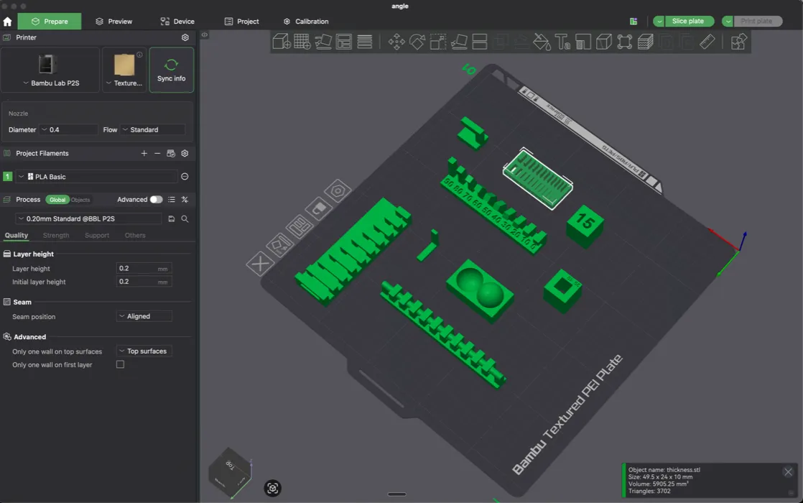

**Supports configuration:** Created duplicates of overhang and clearance models — one set with supports enabled, one without — to directly compare results.

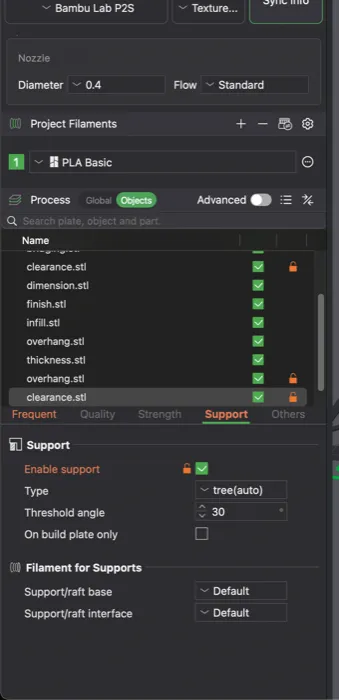

After slicing, Bambu Studio warned about unsupported overhangs. The layer-by-layer preview revealed a critical issue: the overhang L-shape has a tiny 2mm unsupported span.

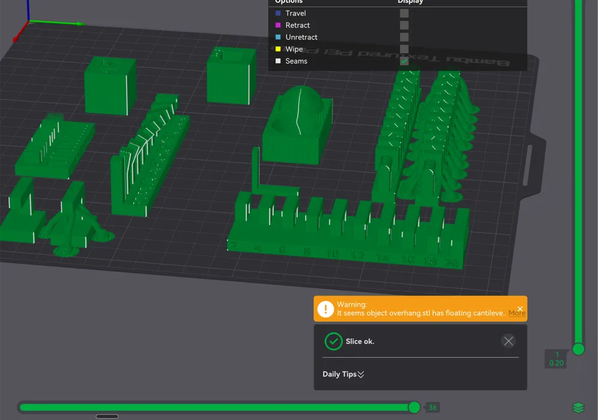

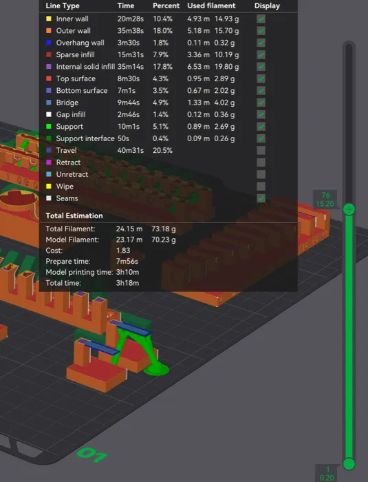

**Printing:** Exported the .3mf file to USB and loaded it on the Bambu P2S. Applied adhesive spray to the bed plate for easier removal.

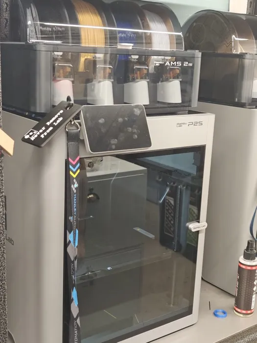

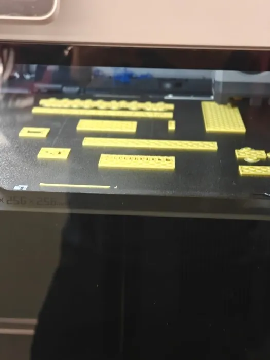

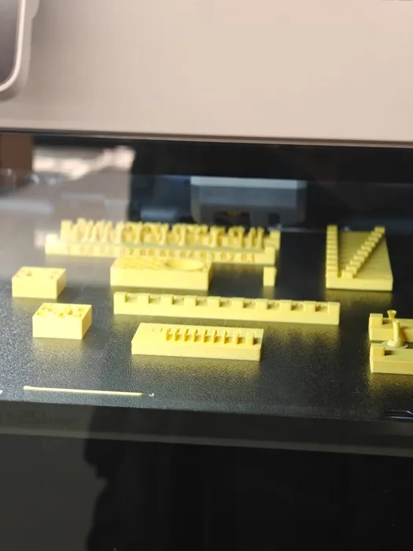

**Results:**

All design rules test pieces printed successfully:

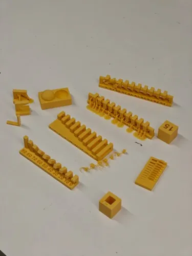

**Clearance test:** Without supports, the top of the clearance piece was a disaster — material sagged badly into the gap.

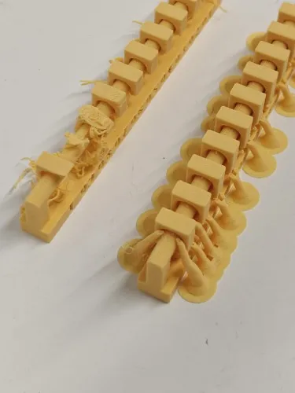

**Overhang test:** Without supports, the overhang drooped at the lowest layers, as expected. The angle test showed at which angles drooping begins.

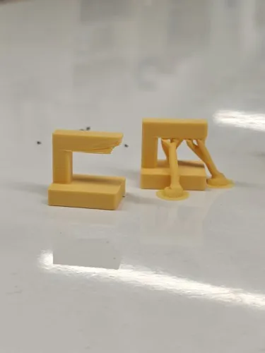

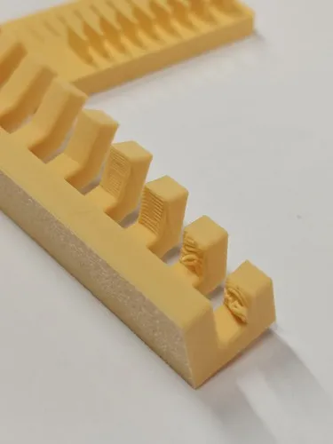

**Anisotropy test:** The lowest layers have long horizontal extrusions while upper layers have shorter ones. As expected, the part snaps easily at the transition point when force is applied.

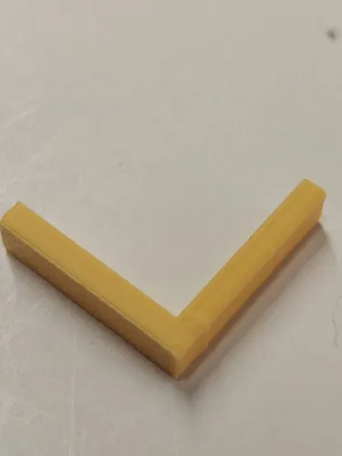

---

# Group conclusions

**Findings:**

- **Ger:** Print-in-place parts with acrylic inserts require precise tolerance control — layer height matters. Large-format (Ginger G1, 3mm nozzle) prints show top-surface dragging between infill gaps at scale.
- **Shaaz:** Overhangs without supports droop predictably below ~45 degrees. Clearance tests fail badly without supports. Anisotropy causes easy snap at layer-direction transitions. Tolerance for fused filament on the Bambu P2S is approximately 0.5mm.

**Challenges:**

- **Ger:** Acrylic insert tolerance was too tight (3.1mm acrylic vs 0.15mm layer height). "Filament-Stuck" error when gap was insufficient. Top-surface quality issues on large-format prints.
- **Shaaz:** Support structures overlapped with adjacent unsupported test pieces when placed too close together. Overhang warnings from slicer needed to be intentionally ignored for comparison testing.

**Solutions:**

- **Ger:** Rewrote in Grasshopper to parametrically test a series of dimensions. Wrote a separate script for bridge testing with wall contours only (no volumes).
- **Shaaz:** Separated and re-spaced the supported and unsupported copies on the build plate. Used Generic PLA profile instead of PLA Basic on instructor's advice for more representative results.

---

# Files

> Add all files created for this group assignment
> 

See below link to to files created this week:
