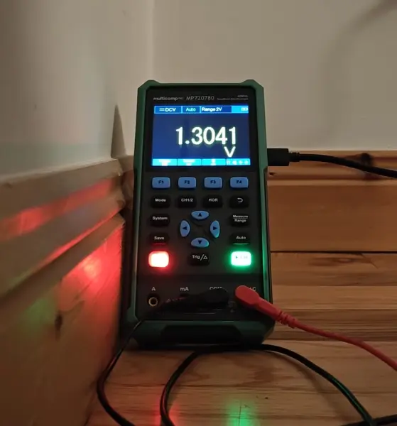
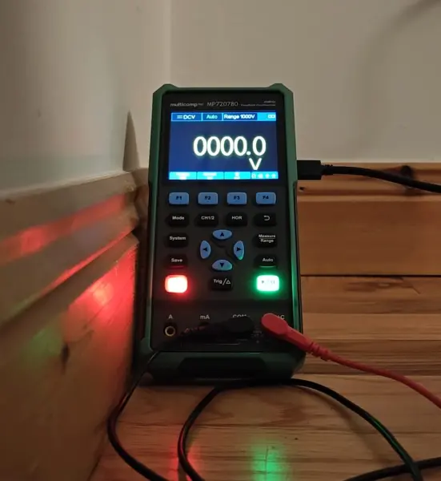
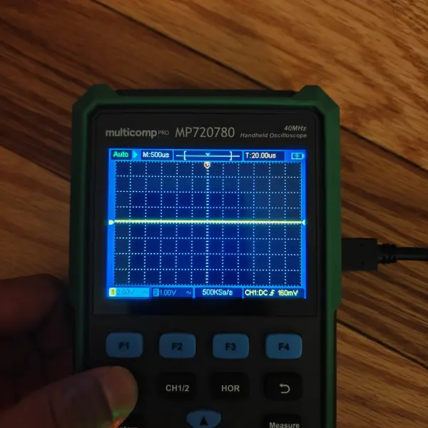
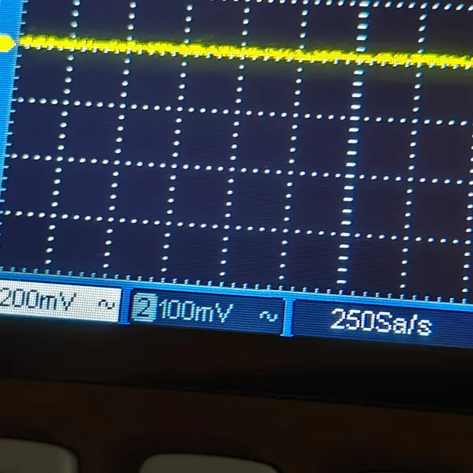
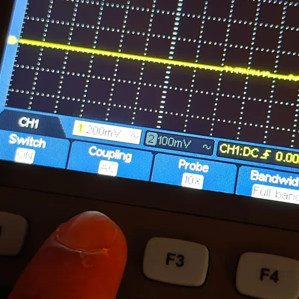
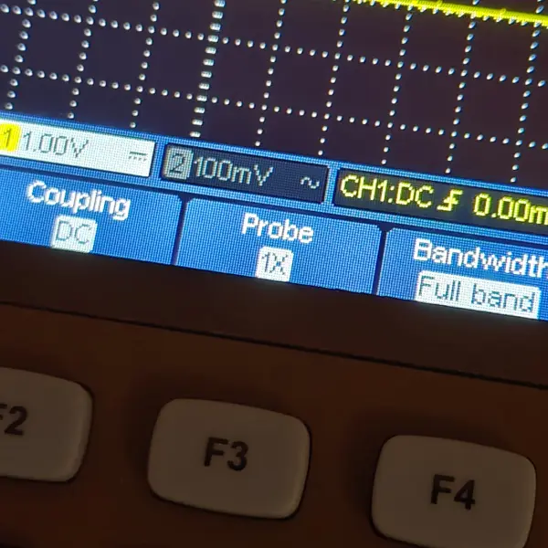
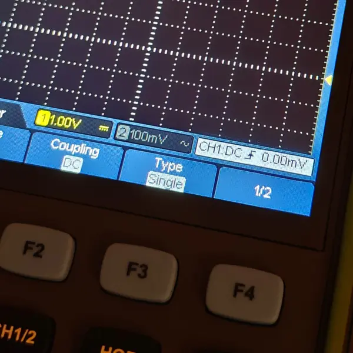
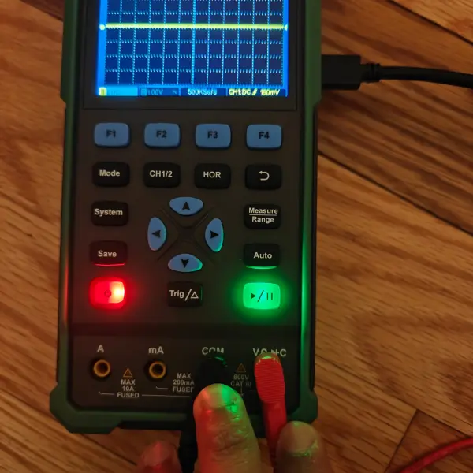

# 6. Electronics Design

<aside>
💡 Group assignment:

- use the test equipment in your lab to observe the operation of a microcontroller circuit board
</aside>

---

# About this week

> *Briefly describe the goal of the assignment. What are you characterizing, testing, or exploring*
>

**Ger:** *(to be added)*

**Shaaz:** Used the Multicomp PRO MP720780 handheld oscilloscope/multimeter to observe the output of an RP2040-based circuit that blinks three LEDs in succession. Measured the voltage on an LED output pin using both voltmeter and oscilloscope modes.

---

# Tools and materials used

> *List all the machines, software and materials used in this assignment.*
>

### Ger: Tools and Materials

*(to be added)*

### Shaaz: Tools and Materials
* Multicomp PRO MP720780 handheld oscilloscope/multimeter
* RP2040-based circuit board (LED blink program)
* Probes (positive on RP2040 output pin, negative on ground)

---

# Process and methodology

> Describe step-by-step what the group did. Include sketches, screenshots, or videos if possible.
>

### Ger:

*(to be added)*

### Shaaz: Voltmeter and Oscilloscope Measurements

**Voltmeter (DCV mode):** Measured the voltage across an LED output pin on the RP2040 circuit.

When the LED was on, the voltmeter read approximately **1.3V DC** on the 2V range — this is the voltage drop across the LED:

When the LED was off, the reading dropped to **0V** as expected, confirming the RP2040 output pin was low:

**Oscilloscope mode:** Switched to oscilloscope mode to try to capture the blinking waveform on the same LED output pin.

Initially got a flat line at 500µs time base — far too fast to see the slow LED blink cycle:

Explored the different settings. The status bar shows channel scales (200mV, 100mV) and sample rate of 250Sa/s:

Tried AC coupling with 10X probe:

Switched to DC coupling with 1X probe, more appropriate for a DC on/off signal:

Tried single trigger type to capture a single on/off transition:

The oscilloscope with probes connected showing some activity, but no clean square wave captured during this session:

**Key takeaway:** The voltmeter confirmed the expected 1.3V/0V output. The oscilloscope time base (500µs default) was too fast to capture the slow LED blink cycle — a much longer time base (seconds, not microseconds) would be needed. This is something to revisit with a faster-switching signal or correct time base settings.

---

# Group conclusions

**Findings:**

- **Ger:** *(to be added)*
- **Shaaz:** Voltmeter mode reliably confirmed the LED output voltage (1.3V on, 0V off). The handheld oscilloscope's default time base settings are tuned for faster signals and need significant adjustment for slow blink patterns.

**Challenges:**

- **Ger:** *(to be added)*
- **Shaaz:** Could not capture a clean square wave on the oscilloscope — the LED blink period was much longer than the 500µs default time base.

**Solutions:**

- **Ger:** *(to be added)*
- **Shaaz:** Would need to set the horizontal time base to seconds rather than microseconds, or use a faster-switching test signal.

---

# Files

> Add all files created for this group assignment
>

See below link to files created this week:
