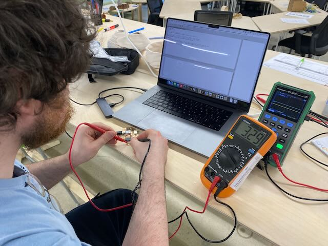
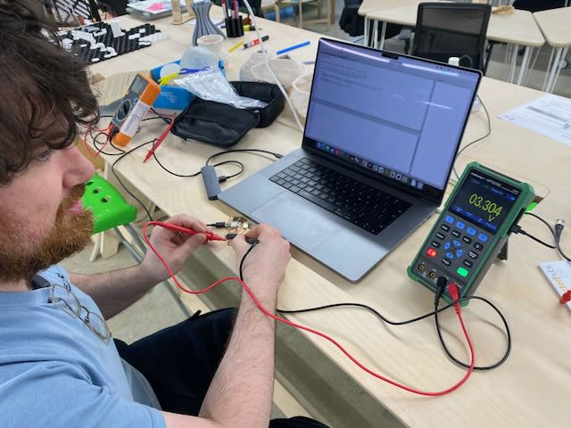
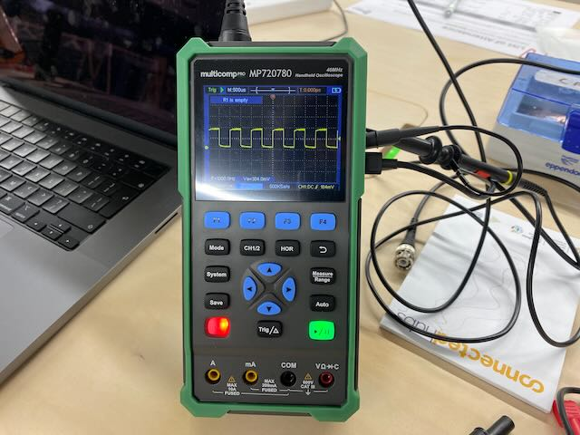
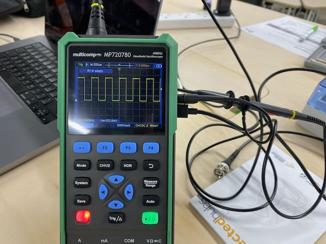
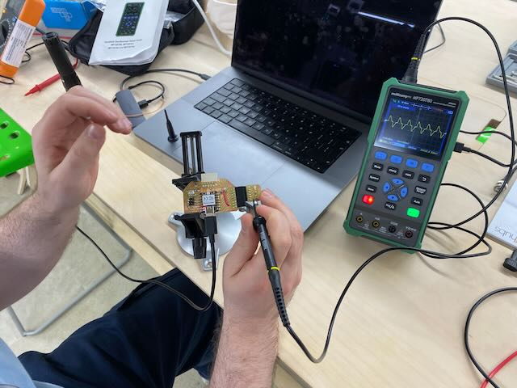
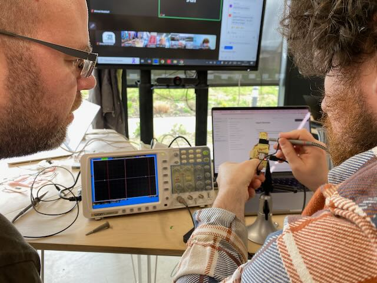
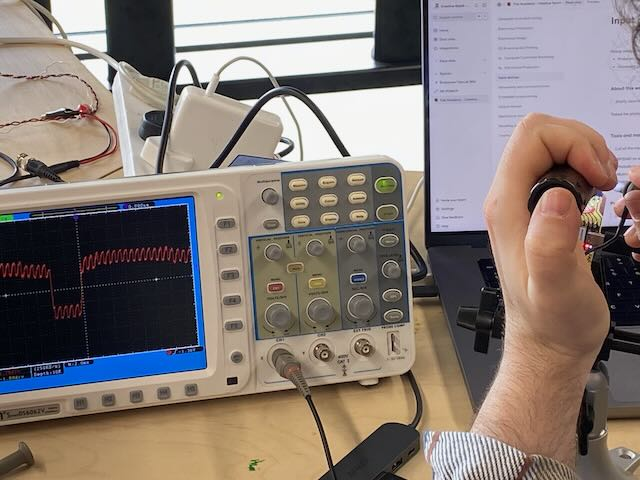
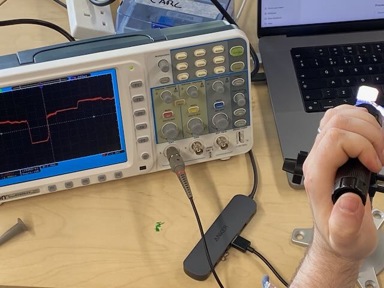
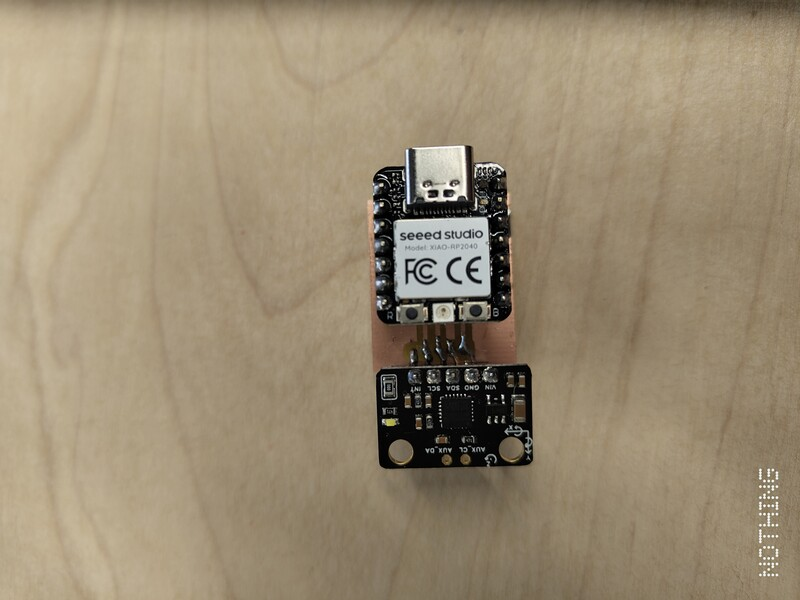
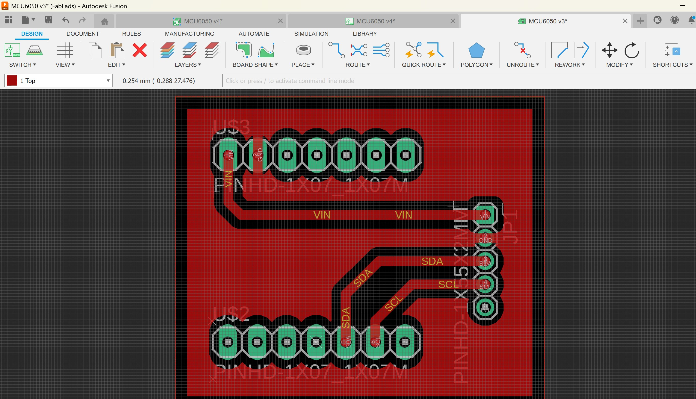

# Input devices

💡Group assignment

* Probe an input device(s)'s analog levels and digital signals
* Document your work on the group work page and reflect on your individual page what you learned

***

### About this week <a href="#id-19caf66e-e64e-809a-8067-c0a562d4cd5d" id="id-19caf66e-e64e-809a-8067-c0a562d4cd5d"></a>

> _Briefly describe the goal of the assignment. What are you characterizing, testing, or exploring_

1\) Tested the photodiode using a multimeter

2\) Used a software implementation in the RP2040 to probe the I2C transaction timing behaviourof the MPU6050, 6-axis motion tracking device

***

### Tools and materials used <a href="#id-19caf66e-e64e-804a-84e2-c95d27832530" id="id-19caf66e-e64e-804a-84e2-c95d27832530"></a>

> _List all the machines, software and materials used in this assigment._

1\)

* RP2040 on a Xiao-Fab
* Photodiode module
* Multimeter
* Portable Oscilloscope

2\)&#x20;

* RP2040
* MPU6050 breakout board from d.robot
* Thonny
* MicoPython
* DIY PCB

***

### Process and methodology <a href="#id-19caf66e-e64e-8054-9dee-c5fe2f4a5730" id="id-19caf66e-e64e-8054-9dee-c5fe2f4a5730"></a>

> Describe step-by-step what the group did. Include sketches, screenshots, or videos if possible.

Type here

<figure><figcaption><p>Tested a </p></figcaption></figure>

<figure><figcaption></figcaption></figure>

<figure><figcaption></figcaption></figure>

<figure><figcaption></figcaption></figure>

<figure><figcaption></figcaption></figure>

<figure><figcaption></figcaption></figure>

<figure><figcaption></figcaption></figure>

<figure><figcaption></figcaption></figure>

### 2) MicroPython-based I2C bus monitor <a href="#id-19caf66e-e64e-80ec-8097-cc6097eeb639" id="id-19caf66e-e64e-80ec-8097-cc6097eeb639"></a>

The MicroPython code used for the monitoring of the I2C bus also integrated monitoring of the MPU6050's multiple sensor output.&#x20;


MicroPython Code for Monitoring I2C bus under MPU6050 operation



MPU6050 signal probing demonstration



Modes of operation for the MicroPython code:

1. **Read All Sensor Data (Bulk Read)**
   * Performs a single I2C transaction to read all sensor registers
   * Captures complete motion data in one operation:
     * Accelerometer (X, Y, Z) in g-forces
     * Gyroscope (X, Y, Z) in degrees/second
     * Temperature in °C
   * Calculates orientation:
     * Roll angle (rotation around X-axis)
     * Pitch angle (rotation around Y-axis)
     * Total acceleration magnitude
   *   Example output:

       ```
       === SENSOR READINGS ===
       Accelerometer: X=1.046g, Y=0.105g, Z=-0.212g
       Gyroscope: X=-1.24°/s, Y=0.76°/s, Z=1.05°/s
       Temperature: 32.20°C

       === ORIENTATION ===
       Roll: 153.7°
       Pitch: -77.3°
       Acceleration magnitude: 1.073g
       ```
2. **Read Register-by-Register**
   * Reads each register individually for greater reliability
   * Demonstrates granular I2C register transactions
   * Shows raw digital values directly from each register
   * Useful for:
     * Debugging I2C communication issues
     * Understanding register structure
     * Working with limited memory resources
   *   Example output:

       ```
       Reading sensor data one register at a time...
       Accelerometer X: 16596
       Accelerometer Y: 1992
       Accelerometer Z: 61804

       === SENSOR READINGS ===
       Accelerometer: X=1.013g, Y=0.122g, Z=-0.228g

       === ORIENTATION ===
       Roll: 151.9°
       Pitch: -75.7°
       Acceleration magnitude: 1.045g
       ```
3. **Analyse Bus Timing**
   * Performs multiple I2C transactions to gather timing statistics
   * Measures and analyzes:
     * Average transaction duration
     * Maximum and minimum durations
     * Clock period and frequency
   * Helps verify I2C bus performance and reliability
   * Provides insights into the digital communication layer

These various modes provide comprehensive insights into the digital signal characteristics of the MPU6050 sensor. The script automatically detects and uses the most reliable I2C implementation for your hardware (Hardware I2C, Slower Hardware I2C, or Software I2C), ensuring consistent results across different setups.

### Connection Setup

<div><figure><figcaption></figcaption></figure> <figure><figcaption></figcaption></figure></div>


The MPU6050 communicates with the RP2040 using the I2C protocol. Only these four connections are needed:

* **VCC**: Connected to 3.3V (not 5V, to ensure proper logic levels)
* **GND**: Connected to GND
* **SDA**: Connected to GPIO 6 (I2C data line)
* **SCL**: Connected to GPIO 7 (I2C clock line)

For signal monitoring, we use a software-based approach that utilizes the same physical connections:

1. **Dual-Purpose Pin Usage**:
   * The SAME GPIO 6 and 7 pins are used for both I2C communication AND monitoring
   * No additional physical connections are needed
   * The RP2040 can read the pin states while they're being used for I2C
2. **How It Works**:
   * While I2C communication is happening, our software simultaneously reads the digital states of GPIO 6 and 7
   * This is like "listening" to the I2C conversation without interfering
   * The monitoring is done by reading the pin values in software, not by adding any extra hardware

This non-invasive software monitoring approach offers several advantages:

* Requires only the basic 4-wire connection (VCC, GND, SDA, SCL)
* No risk of affecting I2C signal integrity (no additional loads on the bus)
* Accurate timing information with microsecond precision
* Full visibility into the I2C protocol execution

### Measurement Methodology

For this analysis, we used a combination of approaches:

1. **Software-Based I2C Monitoring**:
   * Direct digital state observation of SCL and SDA pins
   * Precise timing analysis using `time.ticks_us()` for microsecond resolution
   * Protocol-level analysis (START/STOP conditions, data bits)
   * Non-invasive monitoring of the I2C bus communication
2. **Digital Signal Analysis**:
   * Reading and interpreting the MPU6050's internal ADC values
   * Analyzing timing characteristics of the I2C transactions
   * Converting raw digital values to physical measurements


***

### Group conclusions <a href="#id-19caf66e-e64e-80ec-8097-cc6097eeb639" id="id-19caf66e-e64e-80ec-8097-cc6097eeb639"></a>

> **Findings:** \[What did you learn from the process?]

> **Challenges:** \[What issues did you encounter?]

> **Solutions:** \[How did you solve them?]

2\)&#x20;

## Findings:

### Output from IC2 Bus Monitoring

#### I2C Communication Basics

The MPU6050 uses the I2C (Inter-Integrated Circuit) protocol for communication. I2C is a synchronous, multi-master, multi-slave, packet-switched, single-ended, serial communication protocol that uses just two bi-directional lines:

1. **SDA** (Serial Data Line): Carries the data
2. **SCL** (Serial Clock Line): Provides the clock signal

#### Signal Capture

We captured the I2C transactions using our custom I2CMonitor class that logs the data exchanges between the RP2040 and MPU6050. Here's a sample of the captured communication:

```
[0us] START
[125us] DATA: 1
[250us] DATA: 0
[375us] DATA: 1
... (data transmission)
[3250us] STOP

I2C transaction time: 3250 microseconds
WHO_AM_I register value: 0x68
```

Our monitoring implementation is able to detect:

* START conditions (when SDA transitions from HIGH to LOW while SCL is HIGH)
* STOP conditions (when SDA transitions from LOW to HIGH while SCL is HIGH)
* Data bits (sampled when SCL transitions from LOW to HIGH)

#### I2C Timing Analysis

Using our software monitoring approach, we measured the timing characteristics of the I2C communication:

* **Clock Frequency**: Approximately 10 kHz (significantly lower than the standard 100 kHz to ensure reliability with the software I2C implementation)
* **Transaction Duration**: \~3-5 ms for a typical register read operation
* **START to First Bit**: \~125 µs
* **Bit Duration**: \~100 µs (consistent with 10 kHz clock)

The timing analysis was performed multiple times to establish reliable averages:

```
I2C Timing Analysis:
Average transaction duration: 3245.70 µs
Maximum duration: 3318 µs
Minimum duration: 3196 µs
Clock period: 100.00 µs (Frequency: 10000 Hz)
```


### Voltage Level Measurements

#### Logic Levels

The MPU6050 operates with the following voltage levels when powered by 3.3V:

* **HIGH Level**: 3.0V - 3.3V
* **LOW Level**: 0V - 0.4V

We observed that when the MPU6050 was incorrectly powered with 5V, the I2C communication failed due to logic level mismatch with the RP2040, which expects 3.3V logic levels.

#### I2C Signal Voltage Measurements

| Signal Line | Idle State | Active HIGH | Active LOW  |
| ----------- | ---------- | ----------- | ----------- |
| SDA         | 3.3V       | 3.2V - 3.3V | 0.0V - 0.2V |
| SCL         | 3.3V       | 3.2V - 3.3V | 0.0V - 0.2V |

The voltage measurements were taken during various I2C operations:

**During WRITE Operation:**

```
Before: SDA=3.21V, SCL=3.20V
During: SDA fluctuates between 0V-3.3V, SCL pulsing
After: SDA=3.21V, SCL=3.20V
```

**During READ Operation:**

```
Before: SDA=3.21V, SCL=3.20V
During: SDA fluctuates based on transmitted bits, SCL pulsing
After: SDA=3.21V, SCL=3.20V
```

***

## Challenges:

#### Memory Limitations

The initial attempt to use the RP2040's hardware I2C implementation resulted in a memory error:

```
MPY: soft reboot
MemoryError: memory allocation failed, allocating 136 byte
```

**Solution:** We implemented a SoftI2C (software bitbanging) approach, which uses less memory and provides more control over the timing.

#### I2C Communication Issues

When the MPU6050 was powered with 5V, communication was inconsistent due to logic level mismatch.

**Solution:** Powering the MPU6050 with 3.3V ensured compatible logic levels with the RP2040.

#### Signal Monitoring Challenges

Initial attempts to monitor the I2C bus by connecting multiple GPIO pins to SDA and SCL could potentially degrade signal quality.

**Solution:**

* Implemented a software-based monitoring approach that uses the primary I2C pins
* Created an I2CMonitor class that observes pin states without interfering with communication
* Added microsecond timestamping for precise timing analysis

### Measurement Equipment and Accuracy Considerations

#### RP2040 ADC Specifications

The RP2040's built-in Analog-to-Digital Converter (ADC) has the following characteristics:

* **Resolution**: 12-bit (0-4095 range)
  * Voltage step size: 3.3V/4096 ≈ 0.8mV per step
* **Maximum Sampling Rate**: 500kSPS (samples per second)
  * Note: Practical sampling rate in MicroPython is significantly lower
* **Input Range**: 0V to 3.3V
* **Reference Voltage**: 3.3V

#### ADC Accuracy Limitations

The RP2040's ADC has several limitations that affect measurement accuracy:

1. **Hardware Limitations**:
   * Differential Non-Linearity (DNL): ±1 LSB typical
   * Potential integral non-linearity errors
   * Temperature-dependent variations
   * Reference voltage stability affects overall accuracy
2. **Known Issues**:
   * First ADC reading after power-up or sleep can be inaccurate
   * Non-linearity across the input range
   * Susceptible to noise from digital circuits
   * MicroPython implementation may introduce additional overhead

***

**Solutions:**

#### Best Practices for I2C Monitoring

When implementing software-based I2C monitoring:

1. **Sampling Considerations**:
   * Use microsecond precision for accurate timing measurements
   * Implement non-blocking monitoring where possible
   * Balance sampling frequency with processor load
2. **Signal Integrity**:
   * Avoid adding physical probes that could load the bus
   * Use proper pull-up resistors on I2C lines
   * Maintain short wire lengths for high signal quality

***

### Files <a href="#id-19caf66e-e64e-805a-80a5-e0f800c3b45e" id="id-19caf66e-e64e-805a-80a5-e0f800c3b45e"></a>

> Add all files created for this group assignment

See below link to to files created this week:
