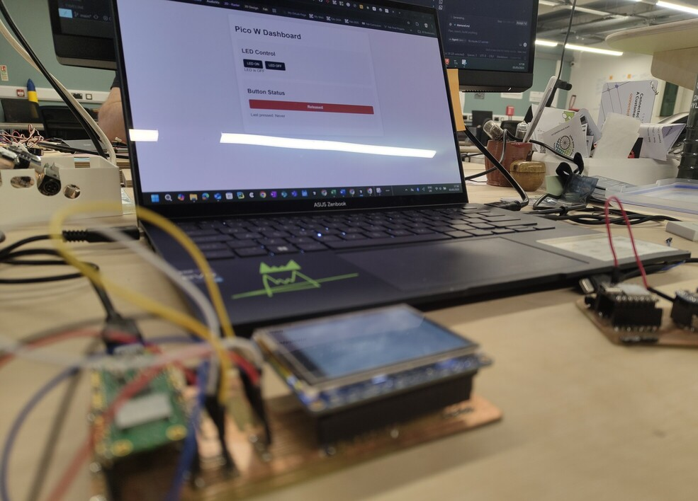
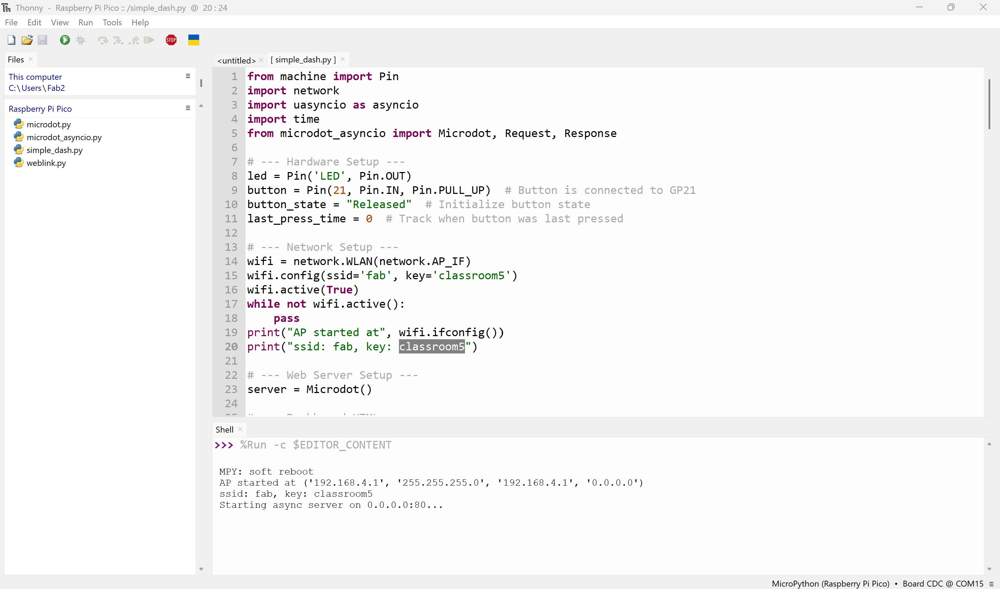
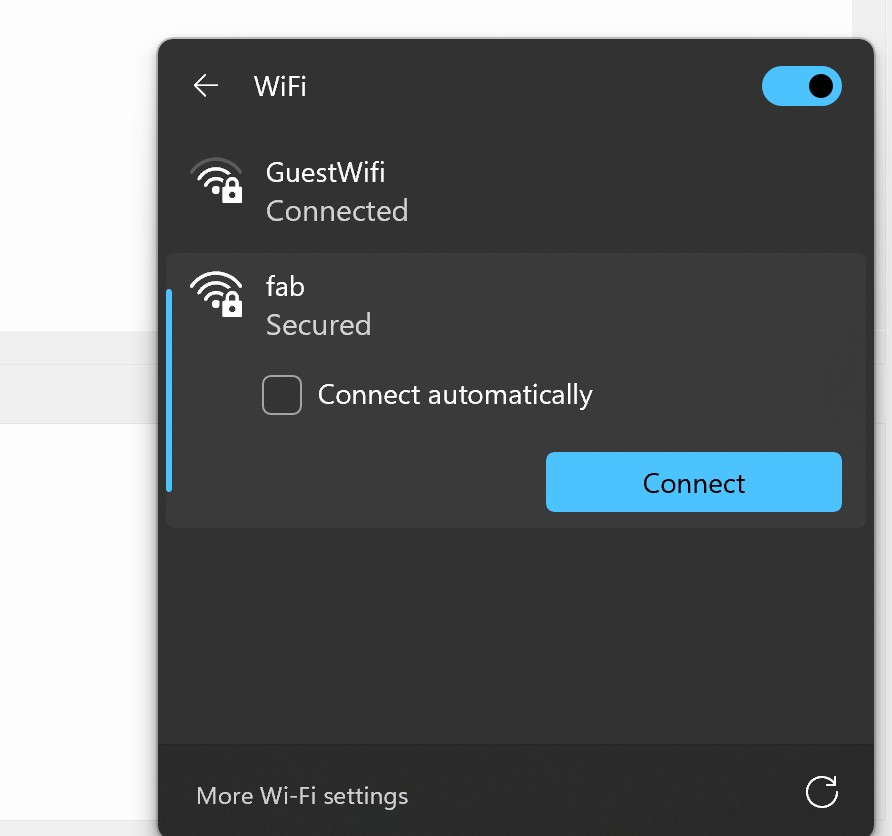
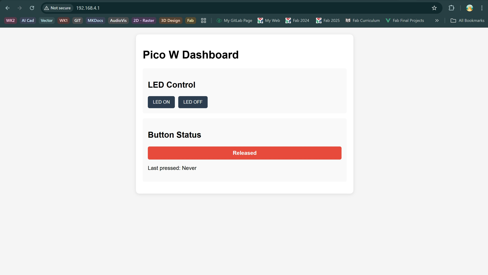

# Interface and Application Programming

💡

Group assignment

* Compare as many tool options as possible.
* Document your work on the group work page and reflect on your individual page what you learned.

***

### About this week 

> _Briefly describe the goal of the assignment. What are you characterizing, testing, or exploring_

For our group assignment, we evaluated several approaches for creating interfaces to microcontrollers. After comparing multiple options, I (Thom) implemented a _web-based dashboard_ approach using MicroPython and the Microdot framework.&#x20;

***

### Tools and materials used 

> _List all the machines, software and materials used in this assigment._

Thom:

For the web dashboard implementation:

* MicroPython programming language
* Microdot web framework
* HTML/CSS/JavaScript for frontend design
* Raspberry Pi Pico W microcontroller
* Push button (connected to GPIO 21)
* Onboard LED for visual feedback
* Web browser (Chrome, Firefox, Safari, etc.) for interface access

***

### Process and methodology 

> Describe step-by-step what the group did. Include sketches, screenshots, or videos if possible.

Thom:

\
\

My implementation uses the Microdot framework to create a lightweight web server ran via Thonny, on the Pico W that:

<figure><figcaption></figcaption></figure>

Sets up a WiFi access point named "fab" with password "classroom5"

<figure><figcaption></figcaption></figure>

Serves a responsive HTML/CSS/JS interface on port 80

<figure><figcaption></figcaption></figure>

* Provides API endpoints for controlling the onboard LED (/on and /off)
* Monitors the state of a physical button connected to GPIO 21



* Updates the web interface in real-time when button state changes
* Displays timestamps of button press events



***

### Group conclusions 

> **Findings:** \[What did you learn from the process?]

> **Challenges:** \[What issues did you encounter?]

> **Solutions:** \[How did you solve them?]

Thom:\
\
Approach Comparison

**Web Dashboard** (My Implementation)


Pros:
\
\- Device-agnostic - works on any device with a browser
\
\- Familiar HTML/CSS/JS technologies
\
\- No app installation required
\
\- Responsive design works on mobile and desktop


Cons:
\
\- Requires network connectivity
\
\- Higher resource usage on microcontroller
\
\- Limited to HTTP protocol without websockets
\

**Best Use Cases:** Ideal for local control systems, home automation interfaces, and projects where multiple users need access through different devices

**-**

**Command Line Interface**
\
Pros:
\
\- Minimal resource usage
\
\- Simple to implement
\
\- Scriptable and automatable
\

Cons:
\
\- Not user-friendly for non-technical users
\
\- Limited visual feedback
\
\- Requires terminal access


\
**Best Use Cases:** Development and debugging tools, headless systems, or scenarios with very limited resources

***

### Files 

> Add all files created for this group assignment

See below link to to files created this week:\
\
Thom:&#x20;








