# Moulding and casting

💡

Group assignment

* Review the safety data sheets for each of your molding and casting materials
* Make and compare test casts with each of them
* Compare printing vs milling molds

***

### About this week 

> _Briefly describe the goal of the assignment. What are you characterizing, testing, or exploring_

Thom: Used a Clear V4 mould formed via the FormLabs 3B+ SLA printer,  to cast Urethane

***

### Tools and materials used 

> _List all the machines, software and materials used in this assigment._

_Carl:_

* Moulding - MBFG Duroflex 30 PU
* Casting - Jesmonite 100A
* Moulding Bonus: EVA Flex Vac Form using last weeks roto-casting machine.

Thom:

Materials

* Polytek Polyflex 30 PU Casting Rubber (Shore A30)
* Polycryl No. 59 Wax Release
* PlastiKote Clear-dry Lacquer Gloss
* Iso-propyl alcohol 99%
* Formlabs Clear V4 Resin
* Plastikote Clear lacquer

Machines

* Formlab Form 3B+
* Formlabs Wash
* Formlabs Wash

Software

* Blender
* Preform

***

### Process and methodology 

> Describe step-by-step what the group did. Include sketches, screenshots, or videos if possible.

Type here

### Jesmonite



<figure>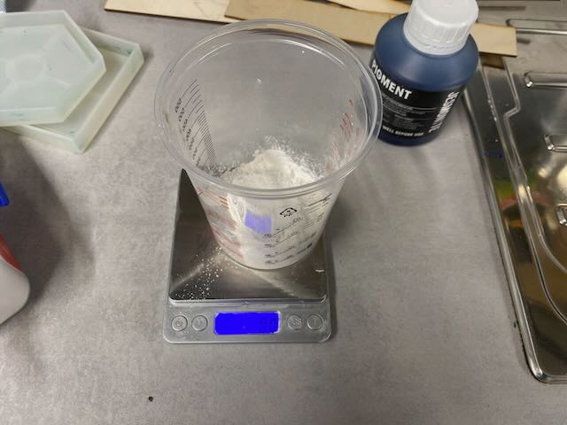<figcaption></figcaption></figure>

Jesmonite uses a 2.5 part dry material to 1 part wet materials.

<figure>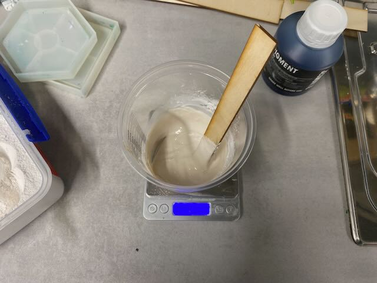<figcaption></figcaption></figure>

It needs to be sired genitally but thoroughly so that you don't need introduce air but fully mix the materials.

<figure>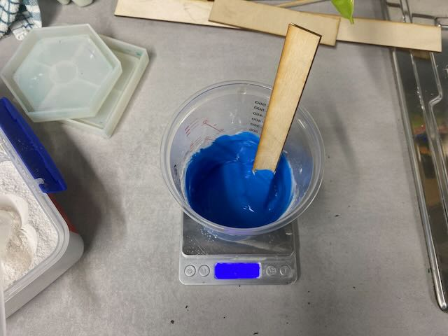<figcaption></figcaption></figure>

I chose to use the pigments for the Jesmonite, in my case you can add up to 2% of the volume&#x20;

<figure>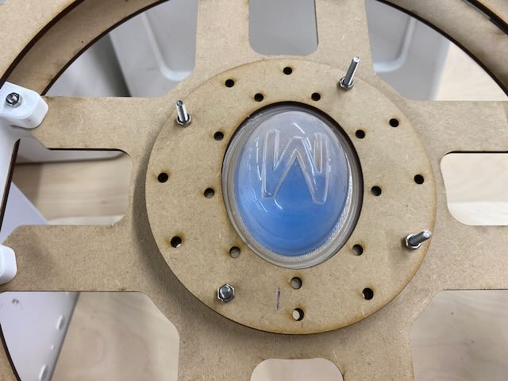<figcaption></figcaption></figure>

I used a mould that came as a sample for a coaster and our egg roto-cast.

<figure>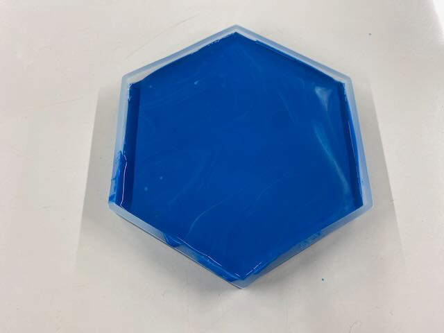<figcaption></figcaption></figure>

<figure><figcaption></figcaption></figure>

<figure><figcaption></figcaption></figure>

### Urethane Rubber

<figure>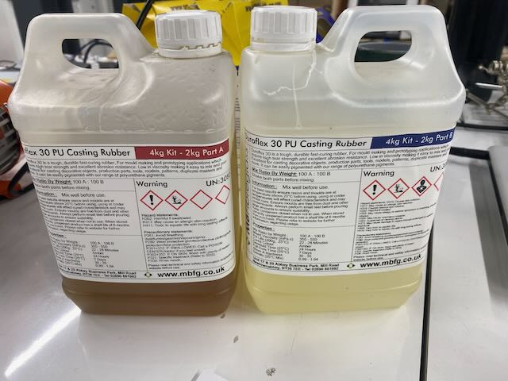<figcaption></figcaption></figure>





<figure>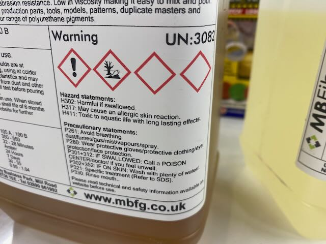<figcaption></figcaption></figure>

<figure>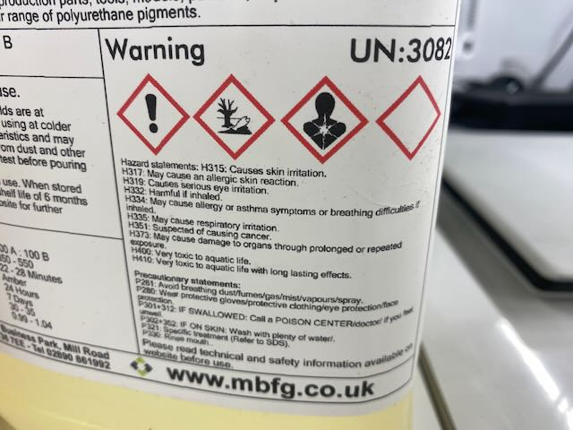<figcaption></figcaption></figure>

<figure>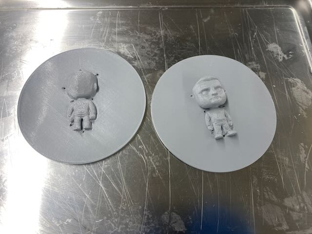<figcaption></figcaption></figure>

<figure>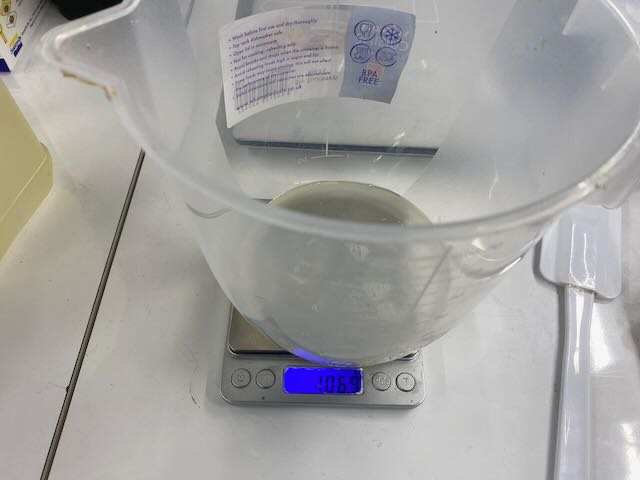<figcaption></figcaption></figure>

<figure>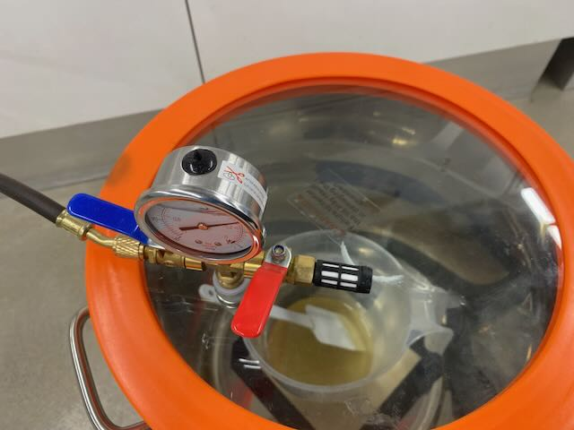<figcaption></figcaption></figure>

<figure>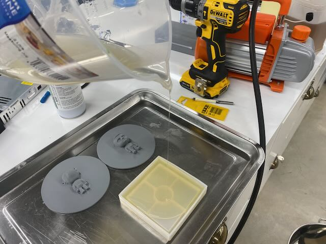<figcaption></figcaption></figure>

<figure>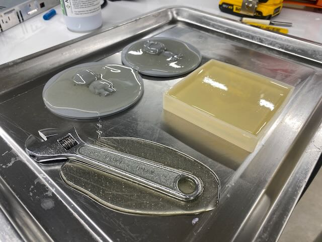<figcaption></figcaption></figure>

<figure>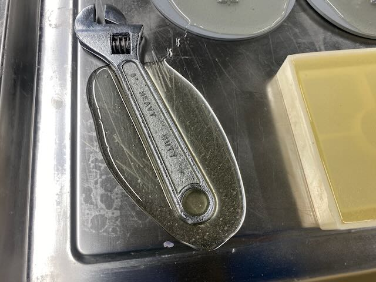<figcaption></figcaption></figure>

<figure>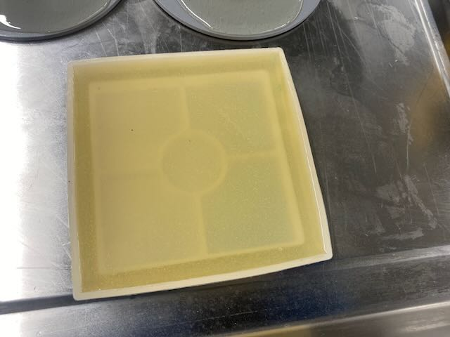<figcaption></figcaption></figure>

<figure>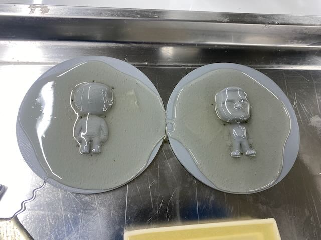<figcaption></figcaption></figure>

<figure><figcaption></figcaption></figure>

<figure><figcaption></figcaption></figure>

<figure><figcaption></figcaption></figure>

<figure><figcaption></figcaption></figure>

<figure><figcaption></figcaption></figure>

***

Thom: Moulding Urethane in a Clear V4 Resin 3D printed Form

Safety Documents:

* [https://formlabs-media.formlabs.com/datasheets/Safety\_Data\_Sheet\_EN-EU\_-\_Clear.pdf](https://formlabs-media.formlabs.com/datasheets/Safety_Data_Sheet_EN-EU_-_Clear.pdf) - Clear V4 Resin Saftey Sheet
* [https://phoenixproductsco.com/wp-content/uploads/2015/10/Isopropyl-Alcohol-99-2670.pdf](https://phoenixproductsco.com/wp-content/uploads/2015/10/Isopropyl-Alcohol-99-2670.pdf) - IPA 99%, Safety Sheet
* [https://cdn.aws.toolstation.com/items/coshh/safety-data-sheet-Plastikote-95217.pdf](https://cdn.aws.toolstation.com/items/coshh/safety-data-sheet-Plastikote-95217.pdf) - Plastikote Clear Lacquer Safety sheet

***

### Group conclusions 

> **Findings:** \[What did you learn from the process?]

> **Challenges:** \[What issues did you encounter?]

> **Solutions:** \[How did you solve them?]

Type here

***

### Files 

> Add all files created for this group assignment

See below link to to files created this week:
