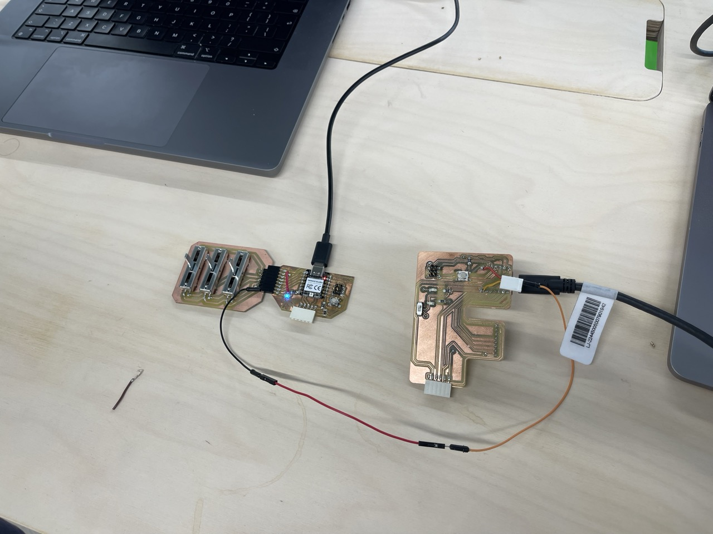
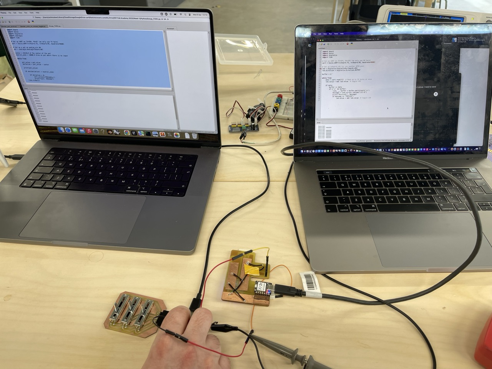

# Networking and communications

💡Group assignment

* Send a message between two projects
* Document your work to the group work page and reflect on your individual page what you learned

***

### About this week <a href="#id-19caf66e-e64e-80b8-84d4-ed596f48b527" id="id-19caf66e-e64e-80b8-84d4-ed596f48b527"></a>

> _Briefly describe the goal of the assignment. What are you characterizing, testing, or exploring_

For this week we are sending a input from one project over TXRX to another project

The input device is Carls linear pot module for a FabXiao.

***

### Tools and materials used <a href="#id-19caf66e-e64e-80c5-a554-f0cbeb7653e5" id="id-19caf66e-e64e-80c5-a554-f0cbeb7653e5"></a>

> _List all the machines, software and materials used in this assigment._

* Thonny
* Fab Xiao (RP2040)
* Thoms Dev board (RP Pico)
* Circuit Python

***

### Process and methodology <a href="#id-19caf66e-e64e-80a2-ab2d-fc20f3d842b3" id="id-19caf66e-e64e-80a2-ab2d-fc20f3d842b3"></a>

> Describe step-by-step what the group did. Include sketches, screenshots, or videos if possible.

#### Transmision:

For the transmitting board we used the following code in CircuitPython to send a UART over the TX and TX pins on our devices.

```
import board
import busio
import digitalio
import analogio
import time

# Set up UART on TX=GD6, RX=D7 (we only use TX here)
uart = busio.UART(tx=board.TX, rx=board.RX, baudrate=9600)

# Set up a pot on analog pin A0
pot = analogio.AnalogIn(board.A0)

center = 65535/2 # The center of the pot
neutral_zone = 10000 # Area on pot where there is no input

while True:
    
    pot_value = pot.value
    deviation = pot_value - center

    print(pot_value)

    if abs(deviation) > neutral_zone: 
        
        if deviation > 0:
            uart.write(b'PRESSED\n')
            print("Sent: PRESSED")
    time.sleep(1)


```

#### Receive

```
import board
import busio
import digitalio
import time

Set up UART on TX=GP4, RX=GP5 (we only use RX here)
uart = busio.UART(tx=board.TX, rx=board.RX, baudrate=9600)

Set up onboard LED (or use another GPIO pin)
led = digitalio.DigitalInOut(board.LED)
led.direction = digitalio.Direction.OUTPUT

buffer = b''

while True:
    data = uart.read(32)  # Read up to 32 bytes at once
    led.value = not led.value  # toggle LED

if data:
    buffer += data
    if b'\n' in buffer:
        line, _, buffer = buffer.partition(b'\n')
        message = line.strip().decode("utf-8")
        print("Received:", message)
        if message == "PRESSED":
            led.value = not led.value  # toggle LED
```


<figure><figcaption></figcaption></figure>

Diarmuid had to modify the Board to access the Tx and Rx pins with some form of header - this required some stealthy soldering skills that we all lack but got there!! It is not the prettiest but it will get the job done!!


<figure><figcaption></figcaption></figure>

We connected the two boards together after attaching a header to Diarmuid's  Fab board for Tx and Rx.&#x20;

Attempted to run the code - something was not working!!

<figure><figcaption></figcaption></figure>

The header on Carls Tx pin was going to ground - to fix this carl just held the cable to the Tx pin on the XIAO RP2040- and we also had to run a cable from ground to ground on each board.

and hey presto - we are networking - sending and receving data.

***

### Group conclusions <a href="#id-19caf66e-e64e-8061-b14c-fb82b8c7a6c0" id="id-19caf66e-e64e-8061-b14c-fb82b8c7a6c0"></a>

> **Findings:** Did not receive as many messages as we sent, must be due to poor connection / noise

> **Challenges:** the development boards we are using have other components on the TXRX pins so we had to get creative as to our connections

> **Solutions:** we ended up probing with jumpers by hand.

Type here

***

### Files <a href="#id-19caf66e-e64e-80a4-95e3-f86c8ad668db" id="id-19caf66e-e64e-80a4-95e3-f86c8ad668db"></a>

> Add all files created for this group assignment

See below link to to files created this week:
