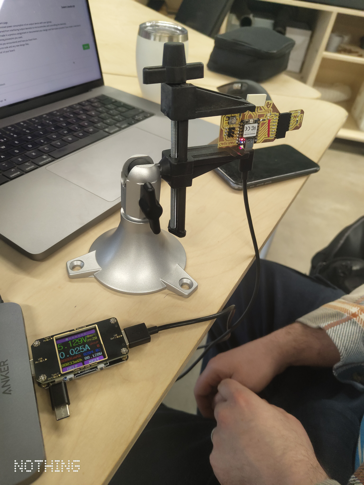

# Output devices

💡Group assignment

* Measure the power consumption of an output device.
* Document your work on the group work page and reflect on your individual page what you learned.

***

### About this week 

> _Briefly describe the goal of the assignment. What are you characterizing, testing, or exploring_

This week we examined the current draw, voltage and resulting power consumption from two output devices being controlled by a RP2040 microcontroller (programmed via the Arduino IDE):\
1\) Blinking LED

2\) A small servo motor.&#x20;

***

### Tools and materials used 

> _List all the machines, software and materials used in this assigment._

* Microcontroller: RP2040
* RP2040 onboard LED
* Small low-voltage servo
* Colour TFT USB Power Meter/Tester
* Arduino IDE and respective code

***

### Process and methodology 

> Describe step-by-step what the group did. Include sketches, screenshots, or videos if possible.

<figure><figcaption></figcaption></figure>

For testing of both output devices, the USB Power Meter was inserted between USB power output (from a laptop), and the USB power input on the RP2040.

1. For the LED, the USB power meter was initially used in the 'Main Interface 1 (main measurement interface)' mode to observe the numerical voltage and current values. The voltage (V) value measured by the meter stayed constant at approximately 5.1v, while the current  (I) was observed at 0.025A (250mA) during LED 'On' and 0.024A (240mA). Hence, the current draw observed by the LED was approximately 10mA. This equates to a power consumption by the LED of 0.0051W or 5.1mW (in operation).
2. To measure the current draw while using the Servo Motor we adjusted the USB Power Meter to the Main Interface 6 (Current Graphing Interface Mode). This allowed us to observe the visual change in current draw, while also obtaining measurements from the referenced gridline interface. In this mode we observed the transition to higher current draw (0.5A - 500mA) while the servo was operating, reducing to a current draw of 0.1A (100mA) when the servo was at rest. This equates to a power consumption range between 0.5W (min) and 2.5W (max).\
   \
   Note: It was observed that obstructing the motion of the servo during operation caused a spike in the current draw as the device physically resisted the obstruction, drawing higher current to stay  in line with its programming.&#x20;

***

### Group conclusions 

> **Findings:** \[What did you learn from the process?]

> **Challenges:** \[What issues did you encounter?]

> **Solutions:** \[How did you solve them?]

Findings:&#x20;

* The mechanical process of the servo required significantly greater current/power to operate than the electroluminescence functionality of the LED.

Challenges:

* The resolution for measuring current on the USB Power Meter was 10mA, so it introduced a large error (+/- 5mA)

***

### Files 

> Add all files created for this group assignment

See below link to to files created this week:
